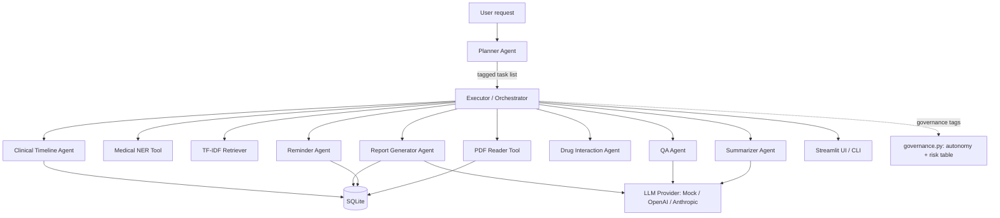

# MediAgent — Agentic AI for Multi-Step Healthcare Task Automation

MediAgent is an NLP mini-project that lets a user type **one natural-language
request** and have it automatically broken into an ordered plan of sub-tasks —
read a medical report, summarize it, flag abnormal values, answer follow-up
questions, check drug interactions, track changes over time, set medicine
reminders, and produce a doctor-ready summary — all executed in sequence by a
planner/executor agent pipeline, with an honest autonomy/risk label on every
step.

> **Example:** *"Summarize my blood report, explain abnormal values, and tell
> me if my medicines interact."* MediAgent understands this as three distinct
> tasks, plans an execution order, runs the right specialist agent for each,
> and returns one consolidated, evidence-backed result.

## What's new in v2

Four things were added on top of the original build, each picked because it's
genuinely implementable without new infrastructure — not because it sounds
impressive on a slide:

| Addition | What it does |
|---|---|
| **Governance layer** (`agents/governance.py`) | Every task carries an autonomy level (A0–A2) and risk tier (R0–R2), shown as badges in the UI |
| **Explainability + confidence** | Abnormal-value claims trace to a concrete `EvidenceItem` (value + reference range); QA answers report an honest low/medium/high confidence from retrieval similarity, not a uniformly confident tone |
| **Drug Interaction Agent** (`agents/drug_interaction_agent.py`) | Cross-checks known medicines against a curated ~18-pair reference table, always deflecting to "confirm with your pharmacist" |
| **Clinical Timeline Agent** (`agents/timeline_agent.py`) | Reconstructs what changed across multiple uploaded reports over time — the most distinctly NLP of the four, built entirely on the NER + date extraction already in the pipeline |

See [Grounded in published research](#grounded-in-published-research) below for exactly what each is based on.

## Why this is "agentic," not just a chatbot

A regular chatbot answers one message at a time. MediAgent's **Planner Agent**
decomposes a single request into a typed task list, an **Executor**
(`agents/orchestrator.py`) runs each task against the right specialist agent
while carrying shared state (the uploaded report, extracted entities, chat
history) between steps, and every step is logged — agent name, status,
autonomy level, risk tier, duration — so the whole decision trail is visible.
This is the same plan → act → observe loop that frameworks like LangGraph
formalize, built here from first principles so every line is explainable in
a viva.

## Architecture

```
                         User request (free text)
                                 │
                                 ▼
                          ┌───────────────┐
                          │ Planner Agent │  intent detection + task decomposition
                          └───────┬───────┘
                                  │ ordered Task[] list, each tagged with
                                  │ an (autonomy, risk) pair from governance.py
                                  ▼
                          ┌───────────────┐
                          │   Executor    │◄──────────────────┐
                          │ (Orchestrator)│                    │ shared session state
                          └───────┬───────┘                    │ (report text, entities,
        ┌───────────┬────────────┼────────────┬───────────┐   │  chat history, reminders)
        ▼           ▼            ▼            ▼           ▼   │
  ┌──────────┐┌───────────┐┌───────────┐┌───────────┐┌────────────┐
  │Summarizer││ QA Agent  ││ Reminder  ││Drug        ││ Clinical    │
  │ Agent    ││ (RAG)     ││ Agent     ││Interaction ││ Timeline    │
  └────┬─────┘└─────┬─────┘└─────┬─────┘│Agent       ││ Agent       │
       │            │            │      └─────┬──────┘└──────┬──────┘
       ▼            ▼            ▼            ▼               ▼
  ┌─────────────────────────────────────────────────────────────────┐
  │ Tools: PDF Reader · Medical NER · TF-IDF Retriever · SQLite DB   │
  └──────────────────────────────┬──────────────────────────────────┘
                                  ▼
                        ┌───────────────────┐
                        │  LLM Provider      │  mock (default) / OpenAI / Anthropic
                        │  (pluggable)       │
                        └─────────┬─────────┘
                                  ▼
                     Report Generator Agent → PDF in reports/
```



## Grounded in published research

Four design decisions in this build are adapted directly from:

> Xu, G., Li, X., Chen, Y., et al. (2026). *A comprehensive survey of AI
> agents in healthcare.* **Journal of Biomedical Informatics**, 179, 105045.

| In MediAgent | From the paper |
|---|---|
| Autonomy levels A0/A1/A2 on every task, and A3 deliberately never used | Table 4's autonomy scale (A0–A3) — the survey's review of 223 studies found **no fully-autonomous (A3) deployments** in clinical practice; this build doesn't claim more autonomy than the published literature supports |
| Risk tiers R0/R1/R2 per task, independent of autonomy | Table 4/6's risk tiering (R0 administrative → R3 direct intervention) |
| Evidence trail behind every abnormal-value claim | Sec. 9.5, "Explainability for trustworthy AI" — explanations should reveal the reasoning process, not just the conclusion |
| Confidence level on QA answers, from retrieval similarity | Sec. 7.3 "LLM-as-a-judge" / Sec. 9.5 "explainable uncertainty" |
| Clinical Timeline Agent | Sec. 4.1.3 "Clinical notes" — reconstructing a coherent timeline from several time-stamped documents rather than treating each one as disconnected |
| Drug Interaction Agent | Sec. 5.4 "Tool Use" — domain-specific reference-data lookups as a bounded, auditable tool call |

This is the kind of citation worth having ready for a viva: it shows the
autonomy/risk framing isn't invented for this project, it's a direct,
attributable application of a peer-reviewed taxonomy — and it's honest about
where the literature itself says the field's limits are (Sec. 8, "Toward
deployment readiness": most healthcare-agent research is still benchmark/
simulation-stage, not real clinical deployment — this project doesn't claim
otherwise either; see below).

## What this project deliberately does NOT include, and why

An earlier planning pass for this project sketched an "enterprise" version
with LangGraph, FastAPI, PostgreSQL, JWT/OAuth, Docker/Kubernetes, ChromaDB,
PubMed/Semantic Scholar integration, multi-modal imaging (X-ray/MRI/ECG), and
an admin analytics dashboard. None of that is in this build. Reasons, stated
plainly:

- **It requires infrastructure this project doesn't have** — a running
  Postgres server, container orchestration, a real auth provider, GPU
  imaging models, external API keys with rate limits — none of which can be
  faked convincingly. A stub JWT layer or a mocked PubMed client would be
  *worse* than not having one: it invites the one viva question that
  unravels it ("show me the token validation").
- **The paper this build cites agrees it shouldn't be claimed lightly**:
  Sec. 8.3 "Governance readiness" and Sec. 9.3 note that even production
  research systems struggle with regulatory classification (EU MDR Rule 11
  / SaMD status), liability assignment, and safety auditing — these aren't
  solved problems the field has, let alone something a mini-project should
  claim to have solved.
- **It doesn't help in placement interviews either.** A recruiter who asks
  a follow-up question about infrastructure you don't actually understand
  is a worse outcome than a smaller, fully-defensible system. Every
  substitution in the table below exists so that every line of this
  codebase can be explained under questioning.

| Wishlist item | What's here instead | Why |
|---|---|---|
| LangGraph / LangChain orchestration | Hand-built Planner → Task list → Executor | Same plan-act-observe loop, zero opaque framework internals |
| FAISS / Sentence-Transformers | scikit-learn TF-IDF + cosine similarity | No model download, deterministic, same retrieval concept |
| SciSpaCy | spaCy + curated `EntityRuler` vocab | Lighter, fully traceable to a vocab file |
| FastAPI + JWT/OAuth backend | Streamlit + CLI, single-process | No real users/auth to protect in a demo; fake auth would be theater |
| PostgreSQL | SQLite, repository pattern | Zero setup; swappable later behind the same `Repository` interface |
| Real drug-interaction API / PubMed / clinical guideline DBs | Curated, disclosed, non-exhaustive reference tables | Honest about scope instead of implying a live medical database connection that doesn't exist |
| Multi-modal imaging (X-ray/MRI/ECG) | Not attempted | Needs real vision models and imaging datasets — a genuinely different, much larger project |
| Docker/K8s, CI/CD, LangSmith/PromptLayer tracing | Not attempted | No deployment target to orchestrate; `utils/logger.py` covers this project's actual observability needs |

## Known limitations

Worth knowing before a demo, not worth hiding:

- The rule-based Planner can occasionally run an extra, low-value task
  alongside the right one (e.g. a generic question-word triggers the QA
  agent even when a more specific intent — reminders, interactions — is
  clearly what's meant). It never gives an *incorrect* answer, just an
  occasional redundant line.
- The Drug Interaction Agent's table has ~18 pairs. It is explicitly
  non-exhaustive and says so in its output — it demonstrates the *pattern*,
  not a production interaction checker.
- The Clinical Timeline Agent needs at least two uploaded reports for the
  same patient before it has anything to compare.
- PDF extraction requires a text layer; scanned image-only PDFs (no OCR)
  raise a clear, caught error rather than silently failing.
- The mock LLM provider is rule-based/extractive, not a real language
  model — this is a deliberate, documented trade-off (see the tech-stack
  table below), not an oversight.

## Tech stack — and why it differs from the original brief

The original spec called for OpenAI GPT, LangGraph/LangChain, Sentence
Transformers + FAISS, and SciSpaCy. This build makes deliberate substitutions
so the whole thing **runs offline, with zero API keys, on any laptop during a
placement demo** — while keeping every concept the brief asked for.

| Layer | Original spec | What's built | Why |
|---|---|---|---|
| LLM | OpenAI GPT (required) | Pluggable `LLMProvider` interface — **mock** (rule-based/extractive) by default, OpenAI & Anthropic as a one-line `.env` swap | Zero cost, zero setup, works with no internet mid-demo; still "configurable" exactly as the brief asked |
| Agent orchestration | LangGraph / LangChain | Hand-built Planner → Task Queue → Executor state machine | Same plan-then-act pipeline, no fast-moving external dependency, every line explainable in a viva |
| Retrieval | Sentence-Transformers + FAISS | scikit-learn TF-IDF + cosine similarity | No model download, deterministic, still demonstrates the "semantic search over report chunks" concept; swappable later |
| NER | spaCy / SciSpaCy | spaCy `en_core_web_sm` + a custom `EntityRuler`/`PhraseMatcher` with a curated medical vocabulary | SciSpaCy models are large and narrow; a curated ruler is lighter, faster, and fully explainable (stock spaCy alone mislabels drug names — confirmed while building this) |
| UI | Streamlit only | Streamlit **and** a CLI | CLI is a zero-dependency fallback if a live Streamlit demo ever misbehaves |
| Storage | SQLite | SQLite via a repository-pattern wrapper (plain `sqlite3`, parameterized queries) | Transparent and easy to defend line-by-line under viva questioning, vs. an ORM's hidden behaviour |
| PDF | PyMuPDF + FPDF/ReportLab | PyMuPDF (read) + ReportLab (write) | ReportLab gives full control over tables/styling for the doctor-summary PDF |

## Folder structure

```
MediAgent/
├── app.py                       # Streamlit UI — v2 design system + governance/evidence panels
├── cli.py                       # Headless CLI demo path
├── config.py                    # Typed settings, single source of truth
├── schemas.py                   # Pydantic domain models, incl. governance + evidence + v2 agents
├── prompts.py                   # Prompt templates for LLM providers
├── requirements.txt / -dev.txt / -llm.txt
├── .env.example
├── ruff.toml                    # Lint config (documents the one intentional rule exception)
├── agents/
│   ├── planner_agent.py         # Intent detection + task decomposition
│   ├── orchestrator.py          # Executor + session memory + DB persistence/rehydration
│   ├── governance.py            # NEW — autonomy/risk table (Xu et al. 2026, Table 4)
│   ├── summarizer_agent.py      # + evidence trail + confidence (v2)
│   ├── qa_agent.py               # + retrieval-confidence scoring (v2)
│   ├── reminder_agent.py         # + confidence gate (v2)
│   ├── drug_interaction_agent.py # NEW
│   ├── timeline_agent.py         # NEW
│   └── report_generator_agent.py
├── tools/
│   ├── pdf_reader.py
│   ├── medical_ner.py
│   ├── vector_store.py          # + query_with_scores (v2)
│   ├── database.py              # + list_reports, update_report_analysis (v2)
│   └── calendar_tool.py
├── llm/                          # base.py, mock/openai/anthropic providers
├── data/medical_vocab/           # diseases/medicines/symptoms/lab_tests.txt + drug_interactions.json (NEW)
├── database/, uploads/, reports/, logs/, models/, assets/
├── utils/                        # logger.py, exceptions.py, text_cleaning.py
└── tests/                        # 57 tests across every module above
```

## Setup

```bash
# 1. Create and activate a virtual environment
python -m venv .venv
source .venv/bin/activate        # Windows: .venv\Scripts\activate

# 2. Install dependencies
pip install -r requirements-dev.txt   # core + pytest + ruff
python -m spacy download en_core_web_sm

# 3. Configure environment
cp .env.example .env              # defaults already work — no key needed

# 4. Run
streamlit run app.py              # UI
python cli.py                     # or: headless CLI
```

## Testing

```bash
pytest          # 57 tests across every module
ruff check .    # lint — currently clean
```

## Status

- [x] **Modules 1–9** — scaffolding, schemas + SQLite, PDF ingestion, medical NER, TF-IDF retrieval, pluggable LLM, planner, task agents + orchestrator, Streamlit UI + CLI
- [x] **v2** — governance layer, explainability/confidence, Drug Interaction Agent, Clinical Timeline Agent, persistence/rehydration fix, full UI redesign
- [x] 57 tests passing, `ruff check .` clean
- [ ] Further error-handling polish (multi-page scanned PDFs, malformed reminder phrasing — see Known limitations)
- [ ] Project report write-up, viva Q&A prep (this README's "Grounded in published research" and "What this deliberately does NOT include" sections are written to be lifted straight into that report)

### Agent list implemented

| Agent | File | What it does | Autonomy · Risk |
|---|---|---|---|
| Planner Agent | `agents/planner_agent.py` | Decomposes one free-text request into an ordered task list | — |
| Orchestrator (Executor + Memory) | `agents/orchestrator.py` | Runs each task, carries state, persists reports, rehydrates a lost session | — |
| Governance layer | `agents/governance.py` | Assigns autonomy/risk to every task and enforces the reminder confidence gate | — |
| Summarizer Agent | `agents/summarizer_agent.py` | Patient summary, key findings, abnormal-value flagging + evidence trail | A0 · R1 |
| QA (RAG) Agent | `agents/qa_agent.py` | TF-IDF retrieval + LLM answer grounded only in retrieved report text, with confidence | A0 · R1 |
| Reminder Agent | `agents/reminder_agent.py` | CRUD for medicine reminders, gated on extraction confidence | A2 · R0 |
| Drug Interaction Agent | `agents/drug_interaction_agent.py` | Curated interaction cross-check across known medicines | A0 · R2 |
| Clinical Timeline Agent | `agents/timeline_agent.py` | Chronological view across every uploaded report | A0 · R1 |
| Report Generator Agent | `agents/report_generator_agent.py` | Builds the downloadable doctor-summary PDF | A1 · R1 |

### How to run a full demo right now

```bash
pip install -r requirements-dev.txt
python -m spacy download en_core_web_sm
streamlit run app.py     # or: python cli.py --pdf your_report.pdf
```

Upload any text-based PDF medical report, then try in the chat:
- *"Summarize my report and explain abnormal values"*
- *"What is my HbA1c?"*
- *"Remind me to take Metformin every morning"*
- *"Are there any interactions between my medicines?"*
- *"Show me the timeline of my reports"* (upload two reports first)
- *"Generate a doctor report"*

## License

MIT — see [LICENSE](LICENSE).
