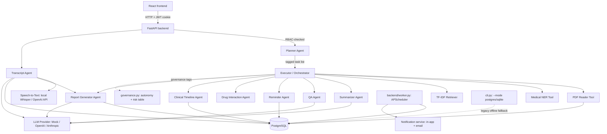

# MediAgent — Agentic AI for Multi-Step Healthcare Task Automation

MediAgent lets a user type **one natural-language request** and have it
automatically broken into an ordered plan of sub-tasks — read a medical
report, summarize it, flag abnormal values, answer follow-up questions,
check drug interactions, track changes over time, set medicine reminders,
and produce a doctor-ready summary — all executed in sequence by a
planner/executor agent pipeline, with an honest autonomy/risk label on every
step. As of v3, it's a real multi-user healthcare platform: a React
frontend, PostgreSQL, role-based access for doctors/patients/nurses/medical
staff, a scheduler + notification system for medicine reminders, and a
transcript-to-report agent that turns a recorded consultation into a
structured clinical note.

> **Example:** *"Summarize my blood report, explain abnormal values, and tell
> me if my medicines interact."* MediAgent understands this as three distinct
> tasks, plans an execution order, runs the right specialist agent for each,
> and returns one consolidated, evidence-backed result.

## What's new in v3

v2 added governance, explainability, drug interactions, and the clinical
timeline (table below). v3 is a bigger jump: the single-patient, offline
Streamlit demo becomes a real multi-user system.

| Addition | What it does |
|---|---|
| **FastAPI + PostgreSQL backend** (`backend/`) | Replaces the Streamlit UI's direct function calls with a real REST API + relational database, needed the moment there's more than one user |
| **JWT auth + RBAC** (`backend/security.py`, `backend/deps.py`) | Four roles — doctor, patient, nurse, staff — each with a distinct, enforced permission scope (see the [RBAC section](#role-based-access-control) below); doctors/nurses only ever see patients they're assigned to |
| **Scheduler + Notification agents** (`backend/services/scheduler_service.py`, `notification_service.py`) | Daily/monthly medicine reminders via APScheduler + a Postgres-backed job store, in-app + email notifications, and automatic low-stock refill alerts |
| **Transcript-to-report agent** (`agents/transcript_agent.py`, `tools/speech_to_text.py`) | Doctor uploads a consultation recording → speech-to-text → structured SOAP note draft → doctor reviews/edits → finalizes into the patient's report history |
| **React frontend** (`frontend/`) | Role-specific dashboards replacing the single-process Streamlit UI |

See [docs/RAG.md](docs/RAG.md) for how the existing retrieval-augmented QA
system works, and [Role-based access control](#role-based-access-control)
below for the v3 permission model.

## What's new in v2

Four things were added on top of the original build, each picked because it's
genuinely implementable without new infrastructure — not because it sounds
impressive on a slide:

| Addition | What it does |
|---|---|
| **Governance layer** (`agents/governance.py`) | Every task carries an autonomy level (A0–A2) and risk tier (R0–R2), shown as badges in the UI |
| **Explainability + confidence** | Abnormal-value claims trace to a concrete `EvidenceItem` (value + reference range); QA answers report an honest low/medium/high confidence from retrieval similarity, not a uniformly confident tone |
| **Drug Interaction Agent** (`agents/drug_interaction_agent.py`) | Cross-checks known medicines against a curated ~18-pair reference table, always deflecting to "confirm with your pharmacist" |
| **Clinical Timeline Agent** (`agents/timeline_agent.py`) | Reconstructs what changed across multiple uploaded reports over time — the most distinctly NLP of the four, built entirely on the NER + date extraction already in the pipeline |

See [Grounded in published research](#grounded-in-published-research) below for exactly what each is based on.

## Why this is "agentic," not just a chatbot

A regular chatbot answers one message at a time. MediAgent's **Planner Agent**
decomposes a single request into a typed task list, an **Executor**
(`agents/orchestrator.py`) runs each task against the right specialist agent
while carrying shared state (the uploaded report, extracted entities, chat
history) between steps, and every step is logged — agent name, status,
autonomy level, risk tier, duration — so the whole decision trail is visible.
This is the same plan → act → observe loop that frameworks like LangGraph
formalize, built here from first principles so every line is explainable in
a viva.

## Architecture

```
   React frontend (frontend/)
            │  HTTP + httpOnly JWT cookie
            ▼
   FastAPI backend (backend/) ── auth + RBAC (deps.py) ── PostgreSQL
            │
            │  builds a fresh Orchestrator(pg_repo, patient_id) per request
            ▼
                          ┌───────────────┐
                          │ Planner Agent │  intent detection + task decomposition
                          └───────┬───────┘
                                  │ ordered Task[] list, each tagged with
                                  │ an (autonomy, risk) pair from governance.py
                                  ▼
                          ┌───────────────┐
                          │   Executor    │◄──────────────────┐
                          │ (Orchestrator)│                    │ shared session state
                          └───────┬───────┘                    │ (report text, entities,
   ┌───────────┬────────────┬────┼────────┬────────────┬──────┘  chat history, reminders)
   ▼           ▼            ▼    ▼        ▼            ▼
┌──────────┐┌───────────┐┌───────────┐┌───────────┐┌────────────┐┌─────────────┐
│Summarizer││ QA Agent  ││ Reminder  ││Drug        ││ Clinical    ││ Transcript   │
│ Agent    ││ (RAG)     ││ Agent     ││Interaction ││ Timeline    ││ Agent        │
└────┬─────┘└─────┬─────┘└─────┬─────┘│Agent       ││ Agent       │└──────┬───────┘
     │            │            │      └─────┬──────┘└──────┬──────┘       │
     ▼            ▼            ▼            ▼               ▼             ▼
  ┌─────────────────────────────────────────────────────────────────┐  ┌────────────┐
  │ Tools: PDF Reader · Medical NER · TF-IDF Retriever · Repository │  │Speech-to-Text│
  └──────────────────────────────┬──────────────────────────────────┘  │(Whisper)    │
                                  ▼                                     └────────────┘
                        ┌───────────────────┐
                        │  LLM Provider      │  mock (default) / OpenAI / Anthropic
                        │  (pluggable)       │
                        └─────────┬─────────┘
                                  ▼
                     Report Generator Agent → PDF in reports/

   backend/worker.py (separate process) ── APScheduler + Postgres job store
            │
            ▼
   Scheduler + Notification + Refill services ── in-app + email (SMTP/mock)
```



## Grounded in published research

Four design decisions in this build are adapted directly from:

> Xu, G., Li, X., Chen, Y., et al. (2026). *A comprehensive survey of AI
> agents in healthcare.* **Journal of Biomedical Informatics**, 179, 105045.

| In MediAgent | From the paper |
|---|---|
| Autonomy levels A0/A1/A2 on every task, and A3 deliberately never used | Table 4's autonomy scale (A0–A3) — the survey's review of 223 studies found **no fully-autonomous (A3) deployments** in clinical practice; this build doesn't claim more autonomy than the published literature supports |
| Risk tiers R0/R1/R2 per task, independent of autonomy | Table 4/6's risk tiering (R0 administrative → R3 direct intervention) |
| Evidence trail behind every abnormal-value claim | Sec. 9.5, "Explainability for trustworthy AI" — explanations should reveal the reasoning process, not just the conclusion |
| Confidence level on QA answers, from retrieval similarity | Sec. 7.3 "LLM-as-a-judge" / Sec. 9.5 "explainable uncertainty" |
| Clinical Timeline Agent | Sec. 4.1.3 "Clinical notes" — reconstructing a coherent timeline from several time-stamped documents rather than treating each one as disconnected |
| Drug Interaction Agent | Sec. 5.4 "Tool Use" — domain-specific reference-data lookups as a bounded, auditable tool call |

This is the kind of citation worth having ready for a viva: it shows the
autonomy/risk framing isn't invented for this project, it's a direct,
attributable application of a peer-reviewed taxonomy — and it's honest about
where the literature itself says the field's limits are (Sec. 8, "Toward
deployment readiness": most healthcare-agent research is still benchmark/
simulation-stage, not real clinical deployment — this project doesn't claim
otherwise either; see below).

## What changed between v2 and v3, and why

v1/v2 deliberately stayed a single-patient, offline, zero-infra demo. The
reasoning at the time: no real distinct users meant a stub JWT layer or a
mocked auth provider would have been theater, worse than not having one —
it invites the one viva question that unravels it ("show me the token
validation"). **v3 exists because that premise changed**: the brief now
explicitly calls for multiple real user roles (doctors, patients, nurses,
staff) who must never see each other's data. That's not a demo scenario
anymore — RBAC without a real auth layer isn't RBAC, and "doctors can see
their assigned patients, nurses can't chat" isn't something a single
shared in-memory session (or a hardcoded "Demo Patient") can express. So
v3 adds exactly the pieces that requirement needs, and nothing beyond it:

| Added in v3 | Why it became necessary | What's still *not* here, and why |
|---|---|---|
| FastAPI backend | React needs an HTTP API — it can't call Python functions directly | Still no GraphQL layer or separate API gateway — one FastAPI app is enough for this scope |
| PostgreSQL + SQLAlchemy + Alembic | Multi-user RBAC needs real relational joins (`care_assignments`) and versioned schema migrations, which raw-`sqlite3`-per-query stops paying for itself at | Still no read replicas, connection pooler, or sharding — a single Postgres instance is enough at this scale |
| JWT (httpOnly cookie) + bcrypt | Real distinct user accounts need real authentication, not a hardcoded default patient | Still no OAuth/SSO provider or MFA — self-issued JWTs are enough for this project's own accounts, not federated identity |
| APScheduler + Postgres job store | Daily/monthly reminders need to fire on a schedule even when no one is looking at the app | Still no Celery/Redis — APScheduler needs no new infra beyond the Postgres instance already required |
| `openai-whisper` (local, default) | Transcript-to-report needs real speech-to-text, not a mock | Still no diarization or real-time streaming transcription — batch, single-file only |

What v1/v2 already decided to stay away from is still unchanged in v3:

| Still not attempted | Why |
|---|---|
| LangGraph / LangChain orchestration | Hand-built Planner → Task list → Executor remains the same plan-act-observe loop, zero opaque framework internals — v3's scheduler/notification/transcript agents didn't need it either |
| FAISS / Sentence-Transformers | scikit-learn TF-IDF + cosine similarity remains deterministic and download-free; see [docs/RAG.md](docs/RAG.md) for the full retrieval writeup and the `pgvector` upgrade path now that Postgres exists |
| SciSpaCy | spaCy + curated `EntityRuler` vocab remains lighter and fully traceable to a vocab file |
| Real drug-interaction API / PubMed / clinical guideline DBs | Still a curated, disclosed, non-exhaustive reference table — honest about scope instead of implying a live medical database connection that doesn't exist |
| Multi-modal imaging (X-ray/MRI/ECG) | Still needs real vision models and imaging datasets — a genuinely different, much larger project |
| Docker/K8s, CI/CD, LangSmith/PromptLayer tracing | Still no deployment target to orchestrate; `utils/logger.py` covers this project's actual observability needs |

The same test that applied in v1/v2 still applies: every addition and every
remaining substitution above exists so every line of this codebase can be
explained under questioning, not because it sounds impressive on a slide.

## Role-based access control

Four roles, enforced server-side on every request via `backend/deps.py`'s
`require_role()` / `require_patient_access()` dependencies — not just
hidden UI elements:

| | patient (own record) | doctor (assigned) | nurse (assigned) | staff |
|---|---|---|---|---|
| Reports / timeline / entities / previous conditions | ✔ | ✔ | ✔ | ✘ |
| Chat / QA (RAG) | ✔ | ✔ | ✘ | ✘ |
| Reminders — read | ✔ | ✔ | ✔ | ✘ |
| Reminders — write / mark dose taken | ✔ | ✔ | ✔ | ✘ |
| Generate doctor PDF | ✘ | ✔ | ✘ | ✘ |
| Transcript upload / review / finalize | ✘ | ✔ | ✘ | ✘ |
| Notifications (own) | ✔ | ✔ | ✔ | ✔ |
| Manage user accounts / care assignments | ✘ | ✘ | ✘ | ✔ |
| Patient roster (names only) | ✘ | own list | own list | all |

Doctor/nurse access is scoped by an active `care_assignments` row, not
just role membership — a doctor with no assignment to a patient gets a 403
on every clinical endpoint for that patient, the same as a stranger would.
**Staff is deliberately an administrative role, not a clinical-data
role**: staff can create accounts, chart new patients, and assign
doctors/nurses to them, but can never read report content, chat history,
or transcripts — least-privilege by default. Public self-registration
(`POST /api/auth/register`) only ever creates `patient` accounts;
doctor/nurse/staff accounts are provisioned by an existing staff user via
`POST /api/users`.

## Known limitations

Worth knowing before a demo, not worth hiding:

- The rule-based Planner can occasionally run an extra, low-value task
  alongside the right one (e.g. a generic question-word triggers the QA
  agent even when a more specific intent — reminders, interactions — is
  clearly what's meant). It never gives an *incorrect* answer, just an
  occasional redundant line.
- The Drug Interaction Agent's table has ~18 pairs. It is explicitly
  non-exhaustive and says so in its output — it demonstrates the *pattern*,
  not a production interaction checker.
- The Clinical Timeline Agent needs at least two reports on file (upload or
  a finalized transcript) for the same patient before it has anything to
  compare.
- PDF extraction requires a text layer; scanned image-only PDFs (no OCR)
  raise a clear, caught error rather than silently failing.
- The mock LLM provider is rule-based/extractive, not a real language
  model — this is a deliberate, documented trade-off, not an oversight.
- The default local Whisper speech-to-text path (`STT_PROVIDER=whisper_local`)
  pulls in `torch` and needs a system `ffmpeg` binary — the heaviest
  optional dependency in this project by far; switch to
  `STT_PROVIDER=openai_whisper_api` if you'd rather not install it locally.
- "Missed dose" detection is a ~2-hour-later approximate check ("was
  anything logged taken recently"), not a per-occurrence adherence audit —
  documented in `backend/services/scheduler_service.py`.
- The notification center polls (`GET /api/notifications`) rather than
  pushing over a WebSocket/SSE connection — simpler, and adequate at this
  scale; flagged as a possible later upgrade.
- `backend/worker.py` must be running as its own process for scheduled
  reminders and email dispatch to actually fire — the API process alone
  won't do it (see [Setup](#setup) below).
- RAG retrieval (TF-IDF) is scoped to one report per question, not a
  patient's full history — see [docs/RAG.md](docs/RAG.md) for why, and the
  `pgvector` upgrade path that would change that.

## Tech stack — and why it differs from the original brief

The original spec called for OpenAI GPT, LangGraph/LangChain, Sentence
Transformers + FAISS, and SciSpaCy. v1/v2 made deliberate substitutions so
the whole thing ran offline with zero API keys; v3 keeps every one of
those substitutions and adds the real infrastructure multi-user RBAC
requires (see [What changed between v2 and v3](#what-changed-between-v2-and-v3-and-why) above).

| Layer | Original spec | What's built | Why |
|---|---|---|---|
| LLM | OpenAI GPT (required) | Pluggable `LLMProvider` interface — **mock** (rule-based/extractive) by default, OpenAI & Anthropic as a one-line `.env` swap | Zero cost, zero setup, works with no internet mid-demo; still "configurable" exactly as the brief asked |
| Agent orchestration | LangGraph / LangChain | Hand-built Planner → Task Queue → Executor state machine | Same plan-then-act pipeline, no fast-moving external dependency, every line explainable in a viva |
| Retrieval | Sentence-Transformers + FAISS | scikit-learn TF-IDF + cosine similarity | No model download, deterministic, still demonstrates the "semantic search over report chunks" concept; see [docs/RAG.md](docs/RAG.md) |
| NER | spaCy / SciSpaCy | spaCy `en_core_web_sm` + a custom `EntityRuler`/`PhraseMatcher` with a curated medical vocabulary | SciSpaCy models are large and narrow; a curated ruler is lighter, faster, and fully explainable |
| Frontend | Streamlit only | **React** (Vite + TypeScript + Tailwind) talking to a FastAPI backend | Real multi-role dashboards need real client-side routing/state, not a single-process server-rendered app |
| Backend API | — | **FastAPI**, JWT-via-httpOnly-cookie auth, RBAC dependencies | React needs an HTTP API; RBAC needs a real auth layer (see above) |
| Storage | SQLite | **PostgreSQL** via SQLAlchemy + Alembic migrations (v3); legacy SQLite repository (`tools/database.py`) kept, unmodified, for `cli.py --mode sqlite` | Multi-user RBAC needs real relational joins and versioned schema migrations |
| Scheduling | — | **APScheduler** + a Postgres-backed job store, run as its own process (`backend/worker.py`) | Daily/monthly reminders need to fire without a browser open; no new infra beyond the Postgres instance already required |
| Speech-to-text | — | **openai-whisper** (local, default) or the OpenAI Whisper API (`.env` swap) | Transcript-to-report needs real audio transcription |
| PDF | PyMuPDF + FPDF/ReportLab | PyMuPDF (read) + ReportLab (write) | ReportLab gives full control over tables/styling for the doctor-summary PDF |

## Folder structure

```
MediAgent/
├── cli.py                       # Headless CLI — --mode postgres (default, shares the API's DB) or sqlite (legacy offline path)
├── config.py                    # Typed settings, single source of truth (now incl. DB/auth/email/STT config)
├── schemas.py                   # Pydantic domain models shared by agents (now incl. SOAPNote)
├── prompts.py                   # Prompt templates for LLM providers (now incl. SOAP structuring)
├── requirements.txt / -dev.txt / -llm.txt / -transcription.txt
├── .env.example
├── ruff.toml
├── alembic.ini, alembic/         # Postgres schema migrations (backend/db_models.py is the source of truth)
├── agents/
│   ├── planner_agent.py, orchestrator.py, governance.py
│   ├── summarizer_agent.py, qa_agent.py, reminder_agent.py
│   ├── drug_interaction_agent.py, timeline_agent.py, report_generator_agent.py
│   └── transcript_agent.py       # NEW (v3) — structures a consultation transcript into a SOAP note
├── tools/
│   ├── pdf_reader.py, medical_ner.py, vector_store.py, calendar_tool.py
│   ├── database.py                # legacy SQLite Repository — unmodified, backs cli.py --mode sqlite
│   └── speech_to_text.py, whisper_local_provider.py, whisper_api_provider.py   # NEW (v3)
├── llm/                          # base.py, mock/openai/anthropic providers
├── backend/                      # NEW (v3) — FastAPI + Postgres API
│   ├── main.py, worker.py        # API app / standalone APScheduler process
│   ├── db.py, db_models.py       # SQLAlchemy engine + ORM models
│   ├── pg_repository.py          # Postgres repository — duck-types tools.database.Repository for agents/*
│   ├── schemas_api.py, security.py, deps.py
│   ├── routers/                  # auth, users, patients, assignments, reports, chat, interactions, reminders, notifications, transcripts
│   └── services/                 # scheduler_service, notification_service, email_service, refill_service, stt_service
├── frontend/                     # NEW (v3) — React (Vite + TypeScript + Tailwind)
├── data/medical_vocab/           # diseases/medicines/symptoms/lab_tests.txt + drug_interactions.json
├── docs/RAG.md                   # NEW (v3) — how the retrieval-augmented QA loop works, end to end
├── database/, uploads/, reports/, logs/, models/, assets/
├── utils/                        # logger.py, exceptions.py, text_cleaning.py
└── tests/                        # 57 existing tests (legacy sqlite path) + new backend/RBAC/scheduler/transcript tests
```

## Setup

```bash
# 1. Create and activate a virtual environment
python -m venv .venv
source .venv/bin/activate        # Windows: .venv\Scripts\activate

# 2. Install Python dependencies
pip install -r requirements-dev.txt   # core + FastAPI/Postgres/auth/scheduler + pytest + ruff
python -m spacy download en_core_web_sm
pip install -r requirements-transcription.txt   # optional — only for local Whisper (also needs a system ffmpeg binary)

# 3. Provision PostgreSQL and configure environment
#    (create a database + role however you normally would; any local Postgres works)
cp .env.example .env
#    edit .env: set DATABASE_URL to your Postgres connection string,
#    and JWT_SECRET_KEY to a real random value outside local development

# 4. Run the database migrations
alembic upgrade head

# 5. Install frontend dependencies
cd frontend && npm install && cd ..

# 6. Run all three processes (separate terminals)
python -m uvicorn backend.main:app --reload   # API on :8000
python -m backend.worker                       # scheduler + notification dispatch
cd frontend && npm run dev                      # React on :5173

# Legacy offline fallback (no Postgres/React needed at all):
python cli.py --mode sqlite --pdf your_report.pdf
```

The first account on a fresh database must be a `staff` account, created
directly (there's no self-service staff signup by design):
```bash
python -c "
from backend.db import SessionLocal
from backend.pg_repository import PgRepository
from backend.security import hash_password
db = SessionLocal()
repo = PgRepository(db)
repo.create_user(email='staff@example.com', hashed_password=hash_password('change-me'), full_name='Admin', role='staff')
db.close()
"
```
From there, log in as staff in the React app to create doctor/nurse
accounts and care assignments; patients can self-register.

## Testing

```bash
pytest          # 57+ tests across every module, including the legacy sqlite path
ruff check .    # lint — clean, incl. a scoped B008 exception for FastAPI's Depends() pattern (see ruff.toml)
cd frontend && npm run build   # frontend type-checks and builds cleanly
```

## Status

- [x] **Modules 1–9** — scaffolding, schemas + SQLite, PDF ingestion, medical NER, TF-IDF retrieval, pluggable LLM, planner, task agents + orchestrator, Streamlit UI + CLI
- [x] **v2** — governance layer, explainability/confidence, Drug Interaction Agent, Clinical Timeline Agent, persistence/rehydration fix, full UI redesign
- [x] **v3** — FastAPI + PostgreSQL backend, JWT auth + RBAC (doctor/patient/nurse/staff), APScheduler-based daily/monthly reminders + refill alerts, in-app + email notifications, transcript-to-report agent (local/API Whisper → SOAP note → doctor review → finalize), React frontend; legacy Streamlit UI retired in favor of React, `cli.py` kept as a dual-mode (Postgres/SQLite) dev tool
- [x] 57 legacy tests passing, `ruff check .` clean
- [ ] Further error-handling polish (multi-page scanned PDFs, malformed reminder phrasing — see Known limitations)
- [ ] Project report write-up, viva Q&A prep (this README's "Grounded in published research" and "What changed between v2 and v3" sections are written to be lifted straight into that report)

### Agent list implemented

| Agent | File | What it does | Autonomy · Risk |
|---|---|---|---|
| Planner Agent | `agents/planner_agent.py` | Decomposes one free-text request into an ordered task list | — |
| Orchestrator (Executor + Memory) | `agents/orchestrator.py` | Runs each task, carries state, persists reports, rehydrates a lost session | — |
| Governance layer | `agents/governance.py` | Assigns autonomy/risk to every task and enforces the reminder confidence gate | — |
| Summarizer Agent | `agents/summarizer_agent.py` | Patient summary, key findings, abnormal-value flagging + evidence trail | A0 · R1 |
| QA (RAG) Agent | `agents/qa_agent.py` | TF-IDF retrieval + LLM answer grounded only in retrieved report text, with confidence | A0 · R1 |
| Reminder Agent | `agents/reminder_agent.py` | CRUD for medicine reminders, gated on extraction confidence | A2 · R0 |
| Drug Interaction Agent | `agents/drug_interaction_agent.py` | Curated interaction cross-check across known medicines | A0 · R2 |
| Clinical Timeline Agent | `agents/timeline_agent.py` | Chronological view across every report on file | A0 · R1 |
| Report Generator Agent | `agents/report_generator_agent.py` | Builds the downloadable doctor-summary PDF | A1 · R1 |
| Transcript Agent (NEW, v3) | `agents/transcript_agent.py` | Structures a consultation transcript into a draft SOAP note for doctor review | A1 · R1 |
| Scheduler service (NEW, v3) | `backend/services/scheduler_service.py` | Fires daily/monthly reminder jobs via APScheduler; auto missed-dose follow-up | A2 · R0 |
| Notification service (NEW, v3) | `backend/services/notification_service.py`, `refill_service.py` | In-app + email dispatch; low-stock refill alerts on explicit mark-dose-taken | A2 · R0 |

### How to run a full demo right now

See [Setup](#setup) above for the three-process (API + worker + frontend)
run instructions, or the single-command legacy fallback:
```bash
python cli.py --mode sqlite --pdf your_report.pdf
```

In the React app (after logging in as a patient), try in the chat:
- *"Summarize my report and explain abnormal values"*
- *"What is my HbA1c?"*
- *"Remind me to take Metformin every morning"*
- *"Are there any interactions between my medicines?"*
- *"Show me the timeline of my reports"* (needs 2+ reports on file)
- *"Generate a doctor report"*

...or use the structured UI directly: build a daily/monthly reminder with
quantity tracking, mark doses taken until a refill alert appears in the
notification bell, and (as a doctor) upload a consultation recording to see
it become a reviewable, finalizable SOAP note.

## License

MIT — see [LICENSE](LICENSE).
